#  TBT(템바이템)

디자인 문구 아이템을 제공하는 서비스 및 아이템에 대한 후기를 제공하는 **상품 판매 + 정보 공유 커뮤니티 서비스** 입니다.

- [ TBT(템바이템)](#-tbt템바이템)
  - [📆 프로젝트 기간](#-프로젝트-기간)
  - [👩‍💻 팀원 소개](#-팀원-소개)
  - [✨ 서비스 소개](#-서비스-소개)
  - [⚙ DB ERD 설계](#-db-erd-설계)
  - [📱 화면 설계](#-화면-설계)
  - [📊 프로젝트 기획](#-프로젝트-기획)
  - [💻일자별 작업 List](#일자별-작업-list)
  - [✨ 실제 구현 화면](#-실제-구현-화면)
  - [🎠 프로젝트 회고 및 후기](#-프로젝트-회고-및-후기)
    - [▶ 앞으로도 유지했으면 하는 좋은 점(Keep)](#-앞으로도-유지했으면-하는-좋은-점keep)
    - [▶ 고쳐졌으면 하는 문제점이나 아쉬운 점(Problem)](#-고쳐졌으면-하는-문제점이나-아쉬운-점problem)
    - [▶ 문제점을 해결하기 위해 시도해볼 수 있는 해결책(Try)](#-문제점을-해결하기-위해-시도해볼-수-있는-해결책try)
    - [▶ 이외 나누고 싶은 이야기](#-이외-나누고-싶은-이야기)

## 📆 프로젝트 기간

2022.11.09 ~ 2022.11.22

## 👩‍💻 팀원 소개

| 이름   | 담당 기술              | 기능 구현              |
| ------ | ---------------------- | ---------------------- |
| 강민우 | 백엔드                 | 상품정보 모델링        |
| 권건희 | 백엔드(발표)           | 리뷰 모델링            |
| 백솔비 | 프론트엔드             | 회원가입,로그인 템플릿 |
| 오채현 | 프론트엔드(프론트팀장) | 메인 템플릿            |
| 윤혜진 | 프론트엔드             | 상품정보 템플릿        |
| 주세환 | 백엔드(팀장)           | 사용자 모델링          |

## ✨ 서비스 소개

> 메인 페이지

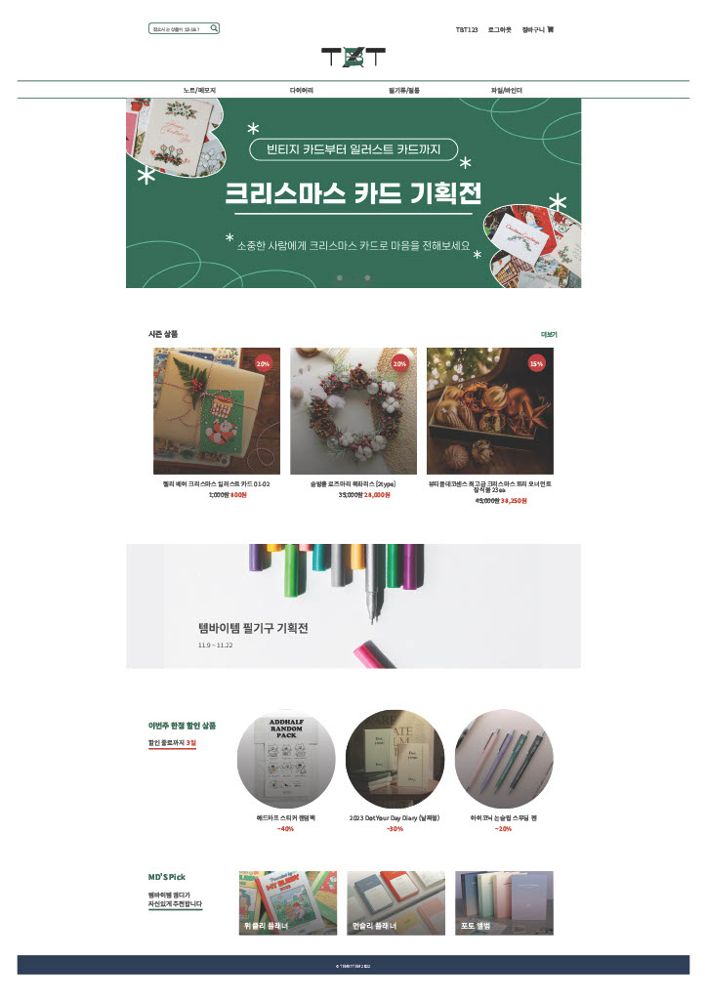

> 상품 카테고리별 목록 페이지

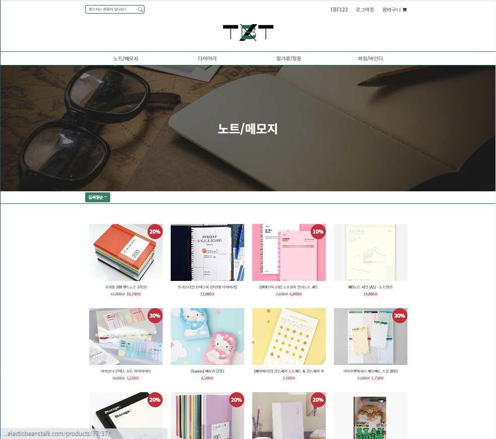

> 상품 디테일 페이지

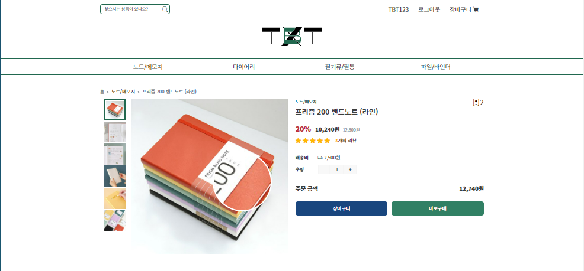
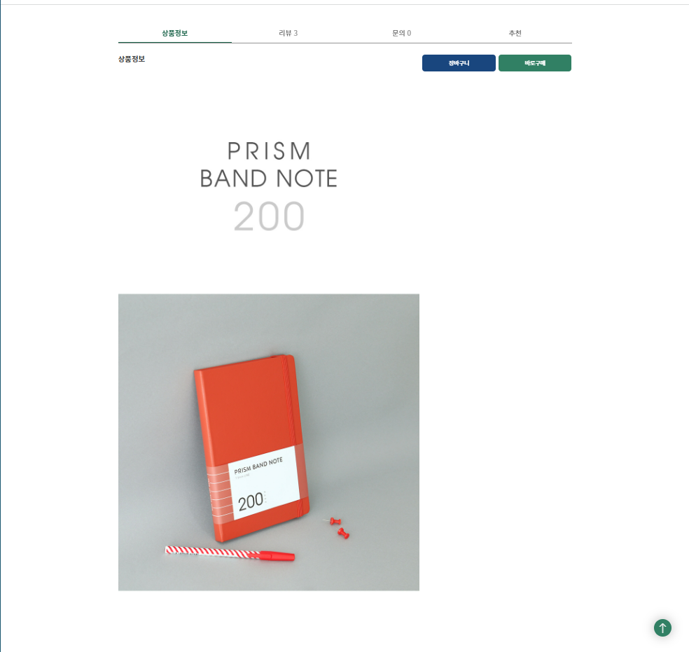
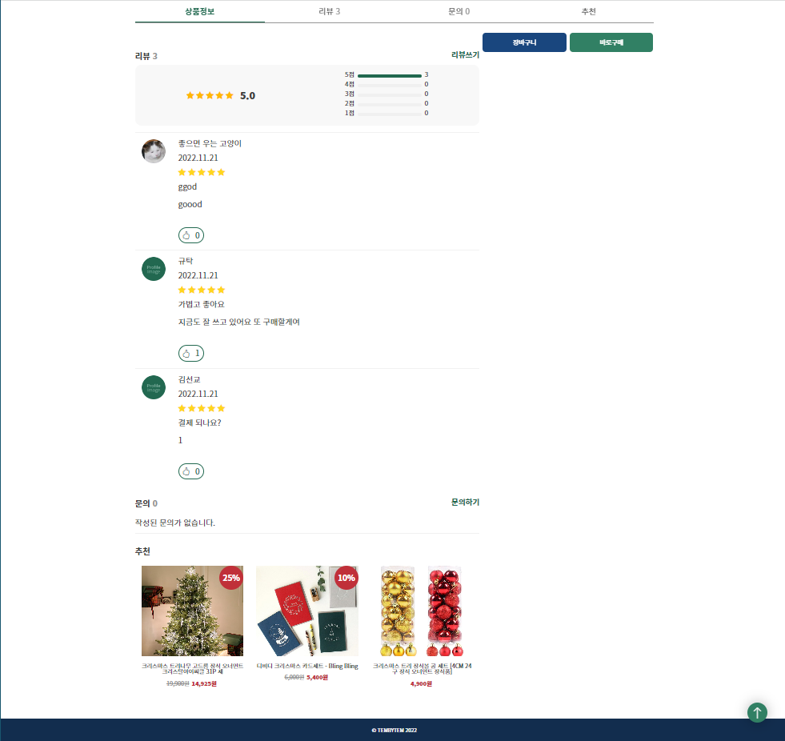

> 장바구니

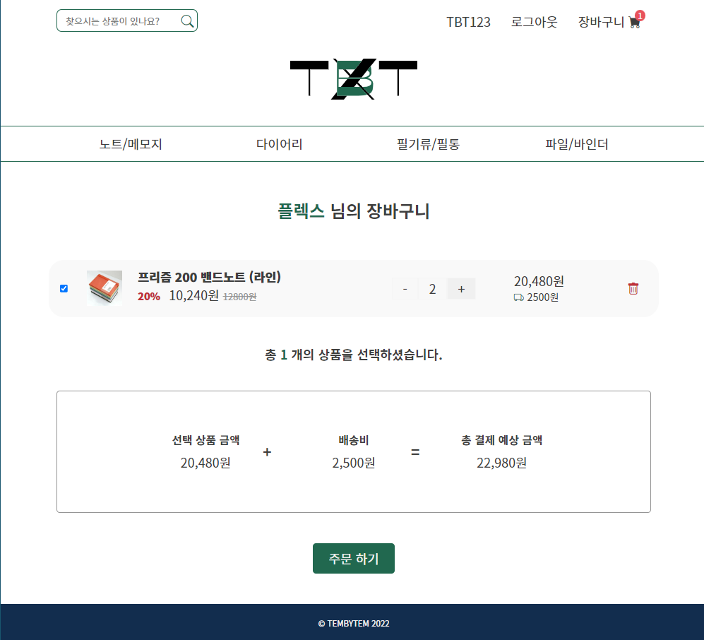

> 주문하기(결제페이지)

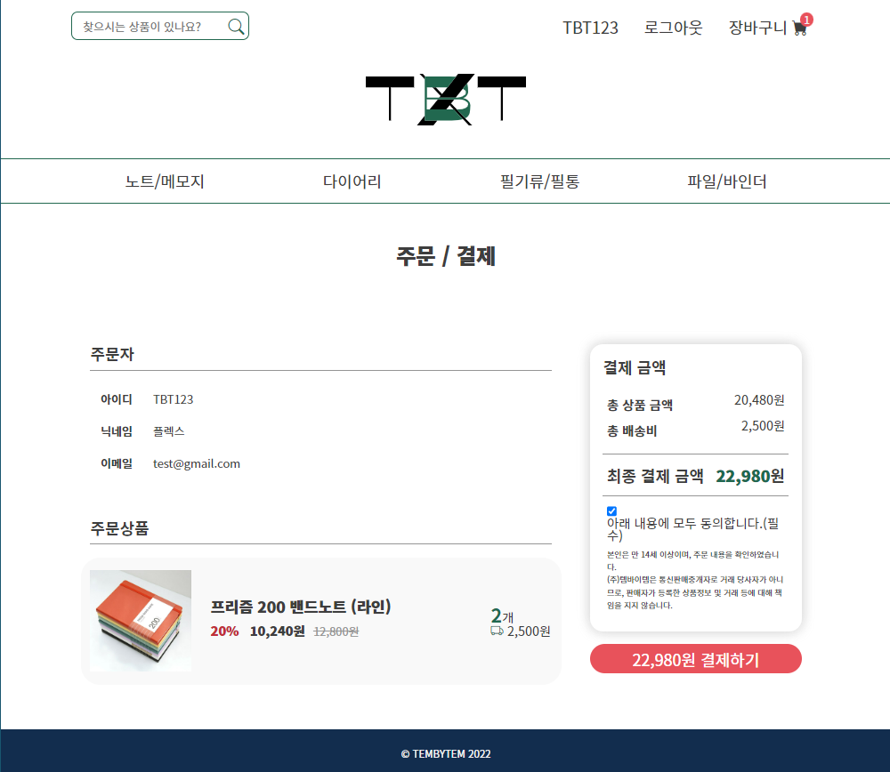

> 결제 완료(주문 완료)

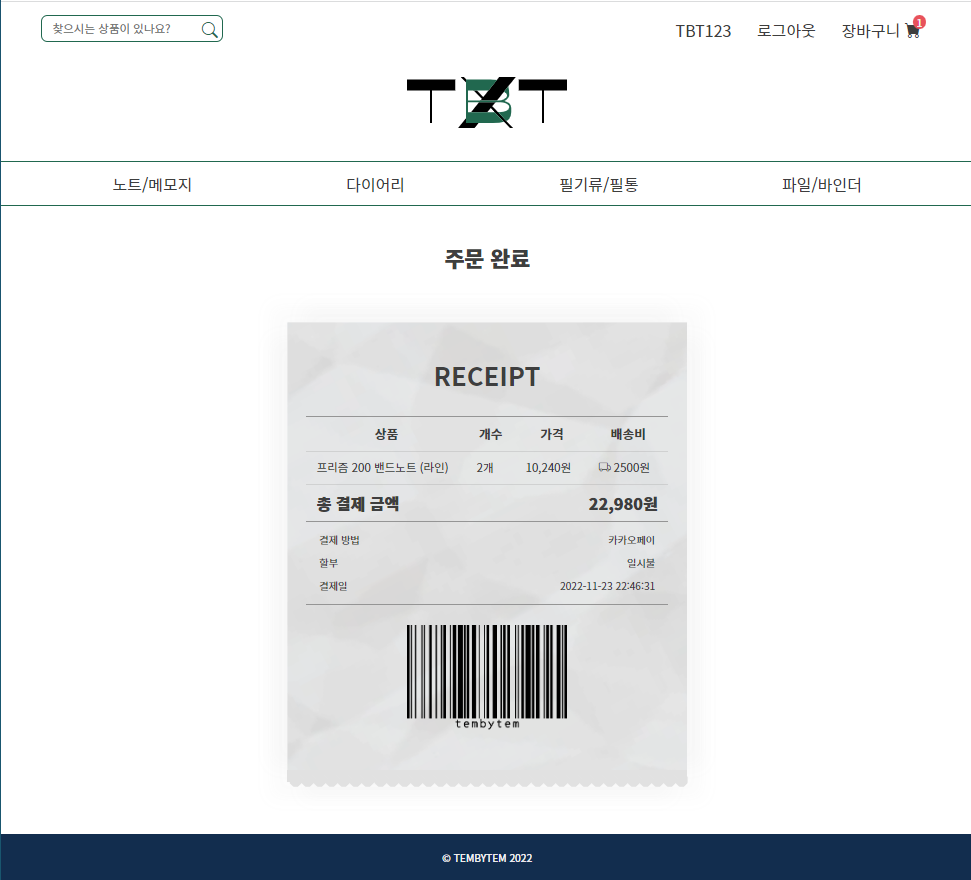

> 회원 상세페이지(마이페이지)

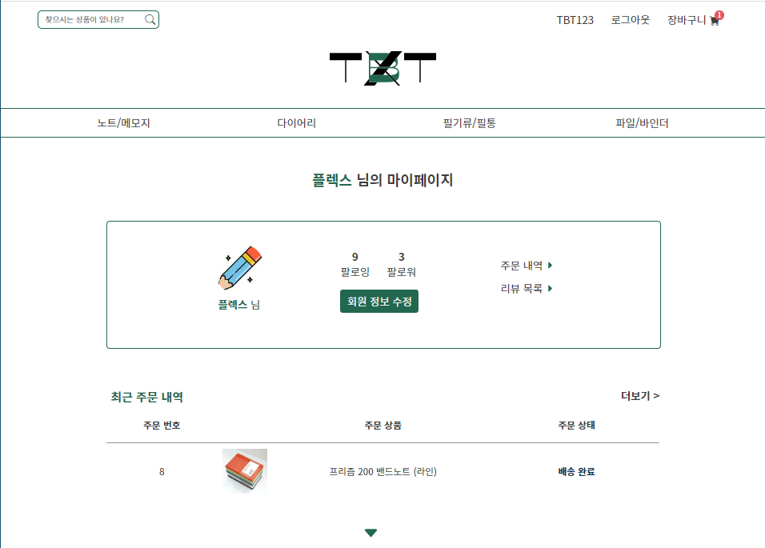
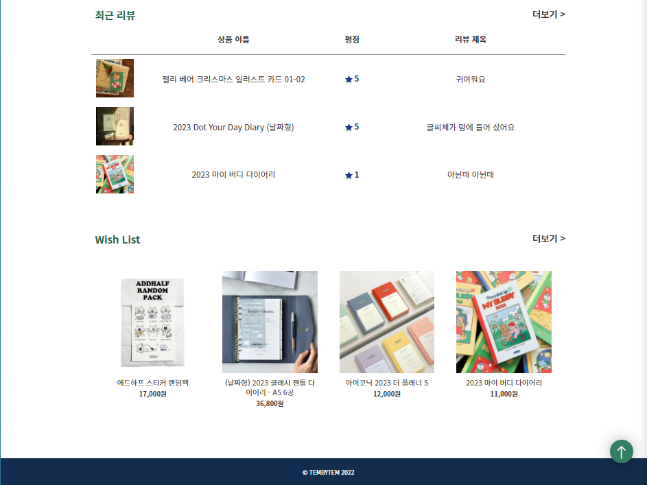

> Wish List(찜목록)

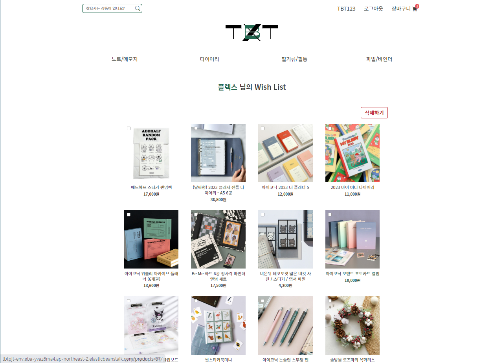
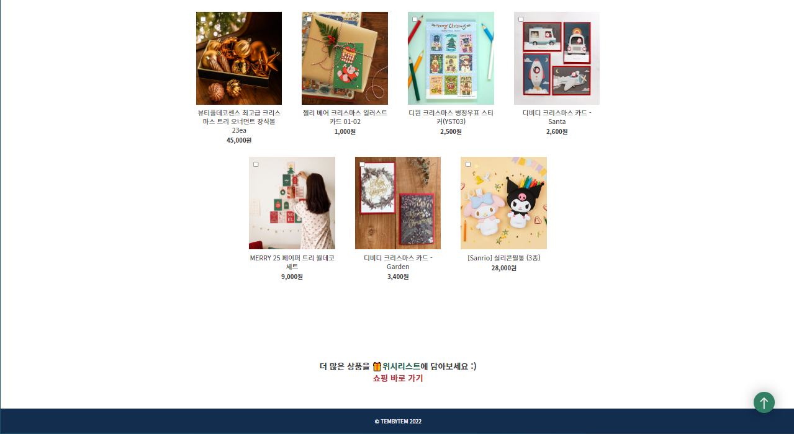

> 내가쓴 리뷰 모아보기

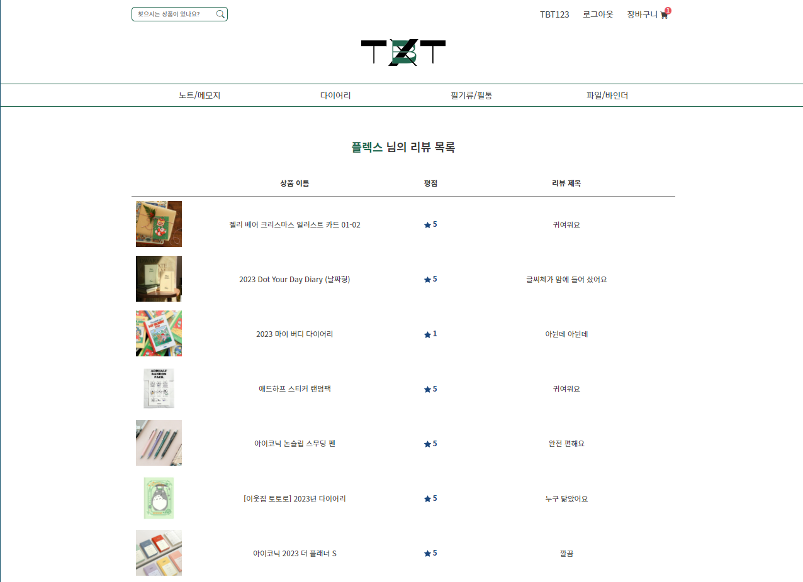

## ⚙ DB ERD 설계

> 초기 ERD 구성

> 최종 ERD 구성

## 📱 화면 설계

Figma를 사용하여 와이어프레임(기초 화면설계)과 추가 세부디자인(색상 및 이미지 노출) 디테일 추가로 수정하여 초반에 구도를 완성하고 진행을 했습니다

> 주제 사전 조사 & 분석

- [텐바이텐](https://www.10x10.co.kr/)
- [문구랜드](https://www.munguland.com/)
- [펜디포](http://pendepot.co.kr/)
- [ban.do](https://www.bando.com/)
- [RIFFLE PAPER CO](https://riflepaperco.com/)
- [PRESENT & CORRECT](https://www.presentandcorrect.com/)
- [PAPER & SOURCE](https://www.papersource.com/)

> 와이어 프레임

- [피그마 공동 설계 페이지로 이동](https://www.figma.com/file/VZehB0Ar4SGnNkHIvDniOh?embed_host=notion&kind=&viewer=1)

> 상세 디자인

- [피그마 공동 설계 페이지로 이동](https://www.figma.com/file/DkSCYhVdZ5vMVneWoCzUdl/TBT---design?node-id=1%3A2)

> 디자인 가이드

## 📊 프로젝트 기획

- 서비스 주요 기능 정리

> 주요 기능

> 추가 기능

## 💻일자별 작업 List

프로젝트 기획

**강민우**

- ERD 설계, 사용자(회원정보) 모델 기초 작업

👨‍💻**권건희**

- ERD 설계, 리뷰모델 기초 작업

👨‍💻**백솔비**

- 와이어프레임 완성

👨‍💻**오채현**

- 와이어프레임 완성
- 메인 페이지 디자인
- 로고 제작

👨‍💻**윤혜진**

- 피그마를 통해 화면 설계(와이어프레임 완성)
- 상품 상세 페이지 디자인

👨‍💻**주세환**

- ERD 설계, 상품정보 모델 기초 작업

프로젝트 제작 1일차

👨‍💻**강민우**

- 상품 정보 모델 추가 작성 및 템플릿 설계

👨‍💻**권건희**

- 리뷰 모델 구현, 리뷰 CRUD 진행

👨‍💻 **백솔비**

- 마이페이지 디자인 완성
- 찜목록 디자인 완성
- 리뷰 페이지 디자인 완성
- 마이페이지 html 완성 후 장고 연결

👨‍💻**오채현**

- 메인, 카테고리 인덱스 디자인 완성
- favicon 생성 후 연결
- 카테고리 인덱스 디자인 완성
- 로그인, 회원가입, 정보수정, 비밀번호 수정 템플릿
- follow 기능 비동기 수정

👨‍💻**윤혜진**

- 상품 리뷰 팝업창 디자인
- 텐바이텐 사이트 크롤링

👨‍💻**주세환**

- 사용자(회원정보) DB구축, 회원정보 CRUD 진행
- 비밀번호 변경 기능 구현
- 팔로우 기능 구현 및 비동기 전환 (채현님 도와주심)

프로젝트 제작 2일차

👨‍💻**강민우**

- json데이터로 제품 목록 구현하기

👨‍💻**권건희**

- 리뷰 디테일 수정
- 좋아요 추가+비동기화

👨‍💻 **백솔비**

- 찜목록 html 완성 후 장고 연결
- 리뷰 목록 html 완성 (시간 괜찮으면 장고 연결)

👨‍💻**오채현**

- 리뷰 템플릿
- 메인 페이지 템플릿

👨‍💻**윤혜진**

- 크롤링한 데이터 DB에 반영
- 상품 목록 페이지 템플릿 작성 및 스타일링

👨‍💻**주세환**

- 찜하기 비동기 구현
- wishlist item 목록 구현
- 마이프로필 리뷰목록 구현

프로젝트 제작 3일차

**강민우**

- 각 카테고리 마다 페이지 구현

👨‍💻**권건희**

- 좋아요 비동기화 작동되게 만들기

👨‍💻 **백솔비**

- 디자인 요소 길이 수정
- 메인페이지 템플릿
- 마이페이지 부분 html header 삭제
- 위시리스트 배치 순서 오류 수정
- django 몇개씩 쪼개기

👨‍💻**오채현**

- 리뷰 비동기 모달 연결
- 리뷰, 문의 모달창 위치 수정
- 리뷰 별점 연결

👨‍💻**윤혜진**

- 상품 목록 페이지 템플릿 작성 및 스타일링

👨‍💻**주세환**

- 각 페이지별 사용자 디테일 수정
- 리뷰 작성자 ⇒ 회원 디테일 페이지 URL 연결
- 장바구니 기능 구현

프로젝트 제작 4일차

👨‍💻**강민우**

- 각 카테고리 마다 페이지 구현

👨‍💻**권건희**

- 좋아요 비동기화 작동되게 만들기

👨‍💻 **백솔비**

- 디자인 요소 길이 수정
- 메인페이지 템플릿
- 마이페이지 부분 html header 삭제
- 위시리스트 배치 순서 오류 수정
- django 몇개씩 쪼개기

👨‍💻**오채현**

- 메인페이지 css 디테일 수정,
- 메인페이지 슬라이드 js 추가,
- 리뷰/문의 모달창 위치 수정,
- 리뷰 좋아요 비동기 오류 수정

👨‍💻**윤혜진**

- 상품 목록 페이지 템플릿 작성 및 스타일링
- 상품 상세 페이지 템플릿 작성 및 스타일링

👨‍💻**주세환**

- 각 페이지별 사용자 디테일 수정
- 리뷰 작성자 ⇒ 회원 디테일 페이지 URL 연결
- 장바구니 기능 구현

프로젝트 제작 5일차

👨‍💻**강민우**

- 상품 구매 기능 구현

👨‍💻**권건희**

- 문의답변 게시판 디테일 수정

👨‍💻 **백솔비**

- 제품 상세 페이지 이미지 돋보기
- 프로필 최근 주문 내역, 최근 리뷰 테이블로 디자인 수정
- 리뷰 목록 디자인 수정

👨‍💻**오채현**

- 리뷰 js 비동기 연결
- 리뷰 별점 연결
- 문의 js 비동기 연결
- 리뷰 썸네일 이미지 팝업

👨‍💻**윤혜진**

- 텐바이텐 사이트에서 크리스마스 상품 페이지 크롤링한 후, DB에 반영

👨‍💻**주세환**

- 장바구니 기능 구현

프로젝트 제작 6일차

- 👨‍👩‍👧‍👧공동작업
  - 버그 확인 및 수정 적용 판단

👨‍💻**강민우**

- 상품 구매 기능 구현

👨‍💻**권건희**

- 발표 스크립트 계획 및 준비
- 문의 게시판 코드 비효율적으로 적힌거 찾아서 수정

👨‍💻 **백솔비**

- 장바구니 템플릿
- 프로필 css 빠진 부분 추가

👨‍💻**오채현**

- 리뷰 수정 연결 변경
- 문의 연결
- 문의-분류 연결
- 문의 수정 변경
- 리뷰 페이지네이션

👨‍💻**윤혜진**

- 상품 상세 페이지 충돌 해결
- 상품 결제 페이지 템플릿 작성 및 스타일링
- 상품 주문 완료 페이지 템플릿 작성 및 스타일링
- 상품 상세 페이지 장바구니/바로구매 버튼 url 연결

👨‍💻**주세환**

- 회원디테일 , 장바구니 디테일 수정,
  

  

프로젝트 제작 7일차

- 👨‍👩‍👧‍👧공동작업
  - 2시 40분 까지 기능 구현 및 진행중인 작업 정리 및 마무리
  - 3시 ~ 3시 40분 : 서비스 內 구현 기능 정상 구현 여부 확인
  - 4시 ~ 5시 50분 : 오류 수정 작업 및 추가 기능 구현 진행
  - 오전 쉬는 시간 : 10시 30분
  - 오후 쉬는 시간 : 16시 30분

👨‍💻**강민우**

- 상품 구매 기능 구현

👨‍💻**권건희**

- 발표 스크립트 수정 및 우선사항 위로 배치
- 발표 연습

👨‍💻 **백솔비**

- 주문 목록 템플릿
- 총 주문 금액

👨‍💻**오채현**

- 문의 답변 수정
- 리뷰 썸네일 이미지 팝업 생성
- 리뷰 좋아요 버튼 효과 추가
- 메인 슬라이드 - 배너 디자인 수정
- 스크롤 탑 버튼 추가
- 리뷰 유저 프로필 이미지 확인
- 리뷰 이미지 블록 확인
- 리뷰/ 문의 모달창 크기 확인
- 메인 body min-height 100vh 지정
- 문의 경로 수정
- 답변 수정 js 삭제
- 내비게이션 장바구니 아이콘 추가

👨‍💻**윤혜진**

- (상품결제페이지) ‘개수’까지 고려해서 상품금액/총상품금액 계산하기
- (상품결제페이지) 카카오결제 후, 결제 완료 페이지로 가도록 연결
- (상품결제페이지) 실제 데이터 연결
- (상품결제완료페이지) ‘개수’까지 고려해서 상품금액/총상품금액 계산하기
- (상품결제완료페이지) 영수증에 그림자 추가
- (상품결제완료페이지) 결제일 추가
- (상품결제완료페이지) 실제 데이터 연결
- (상품상세페이지) 배송비=0일떄, ‘무료배송’으로 뜨게 바꾸기
- (상품상세페이지) 장바구니 버튼 form태그로 변환해서 ‘개수’ 정보 같이 넘어가게 구현
- (상품상세페이지) 수량 기본값이 1개가 되게
- (상품상세페이지) 바로구매 버튼 url 연결(form태그로 변환해서 ‘개수’ 정보 같이 넘어가게 구현)
- (상품상세페이지) 상품 이미지 눌렀을 때 변환
- (상품상세페이지) 수량이 0(즉, 결제금액이 0)일 때, 장바구니/바로구매 버튼을 누를 경우 ‘수량을 선택하세요’ 모달창 뜨게 구현
- (상품상세페이지) 상품 생성/수정 페이지 스타일링
- (상품상세페이지) 관리자만 삭제/수정할 수 있게 설정
- (상품상세페이지) 다른 상품 이미지 눌렀을때 돋보기 기능
- (상품상세페이지) 브레드크럼 크리스마스도 추가
- (최근 주문 내역) 데이터 연결
- (상품상세페이지) 문의 갯수 넣기
- (장바구니페이지) 구매 버튼 눌렀을 때, 결제페이지로 이동하도록 구현

👨‍💻**주세환**

- 장바구니 상품 수량 연동 및 변경 기능
- 장바구니 기능 수량 체크 및 총 합계 수정
- (장바구니페이지) 구매 버튼 눌렀을 때, 결제페이지로 이동하도록 구현

프로젝트 제작 8일차

- 👨‍👩‍👧‍👧공동작업
  - 배포 작업
  - PPT 작업

👨‍💻**강민우**

- 배포 작업
- 추가 수정

👨‍💻**권건희**

- PPT 작업
- 발표 준비

👨‍💻 **백솔비**

- PPT 작업
- 추가 수정

👨‍💻**오채현**

- PPT 작업

👨‍💻**윤혜진**

- 배포
- 추가 수정
- ppt 작성

👨‍💻**주세환**

- 배포
- 추가 수정

## ✨ 실제 구현 화면

- AWS 배포 사이트: <http://tbtpjt-env.eba-yvaz6ma4.ap-northeast-2.elasticbeanstalk.com/>
- 발표 PDF 파일: [PDF 파일](assets/TBT-%EC%84%B8%EB%AF%B8%ED%94%84%EB%A1%9C%EC%A0%9D%ED%8A%B802.pdf)

## 🎠 프로젝트 회고 및 후기

### ▶ 앞으로도 유지했으면 하는 좋은 점(Keep)

- 프론트 3명 백엔드 3명 적절히 역할 배분해서 진행했던 점이 좋았습니다.
- 와이어프레임이랑 상세 디자인을 상세히 짜고 시작해서 프로
- 조장님이 분위기 업을 많이 시켜주셔서 문제 생겼을 때 편하게 얘기할수 있었던 점
- 구현할 기능들을 미리 리스트업 하고 우선순위를 정해서 작업을 진행한 점
- 서로 적극적으로 참여하고 맡은 업무를 할 수 있는 최대한 구현을 하고 부족한 부분은 서로 도와가면서 서로 힘들었겠지만 배려하면서 잘 마무리 할 수 있어서 좋았습니다.
- 빠른 업무 지정을 통해서 빠르게 진행했던 점이 좋았습니다.

### ▶ 고쳐졌으면 하는 문제점이나 아쉬운 점(Problem)

- 배포 과정에서 예상치 못한 오류가 발생하면서 오류를 해결하기 추가로 시간을 들여 팀원 분들과 오류를 해결 할 수 있었습니다 배포를 미리 시간을 가지고 진행을 했었어야 한다고 생각을 하면서 기획 할 때 해당 부분을 고려 못한 점이 아쉬웠습니다.
- 채팅 기능이나 주소 선택 기능 등 더 다양한 기능을 추가하지 못한 점이 아쉬웠습니다.
- 시간이 조금 더 있었더라면 아직 수정하지 못한 부분을 고치거나 기능 업그레이드를 할 수 있었을텐데 벌써 끝나버려서 아쉽습니다.
- 자바스크립트가 미숙했고 그 탓에 다른 분들 코드를 잘 알 수 없어서 도움이 못됐던 거 같아서 아쉬웠습니다
- 결제 부분에서 시간을 너무 많이 써버려서 더 많은 기능들을 구현하지 못한 것 같아 아쉬웠습니다.
- 기획 단계에서 플로우차트를 작성할 시간이 부족해서 플로우차트가 없었던 점이 아쉬웠다.

### ▶ 문제점을 해결하기 위해 시도해볼 수 있는 해결책(Try)

- 배포 오류는 밤에 팀원 분들과 모여 함께 오류를 찾고 집단 지성을 통해서 해결 했으며 향 후 에는 기획 단계에서 배포 오류 수정을 미리 인지하고 좀 더 시간의 비중을 늘려야 할 거 같습니다
- 다음에는 좀 더 새로운 기능을 찾아보고 도전해보려고 합니다.
- 수업 시간외에도 시간을 더 투자해서 구현하였습니다.
- 부족한 부분들을 메꾸기 위해서 정규 시간외에도 계속 시간을 투자했습니다.
- 그나마 구글링하긴 했는데 키워드가 잘못된건지 제대로 정보를 못찾아서 도움이 되지 못했습니다. 다음엔 그나마 기간이 기니까 학습이랑 병행해야 할 것 같습니다.

### ▶ 이외 나누고 싶은 이야기

- 우리 템바이템 팀원분들 다들 너무 수고 많으셨고 감사했습니다!!❤
- 2주가 길다고 생각했는데 벌써 끝나버렸네요. 그동안 다들 쉼 없이 달려오셔서 완성도 높은 홈페이지가 탄생하지 않았나 싶어요! 선택 프로젝트 끝났으니까 다들 푹 쉬세요~~👊
- TBT 팀장님 쵝오!!
- 열정 넘치는 혜진님, 조용한 강자 민우님, 작업 왕 솔비님, 텐션업 건희님, 전천후 능력자 채현님 모두 감사했습니다 이렇게 좋은 팀원 분들을 만날 수 있었서 행복했어요~~~😍
- 다들 최고였어요 감사합니다.
- 부족해도 멱살잡고 캐리해주셔서 감사합니다.
